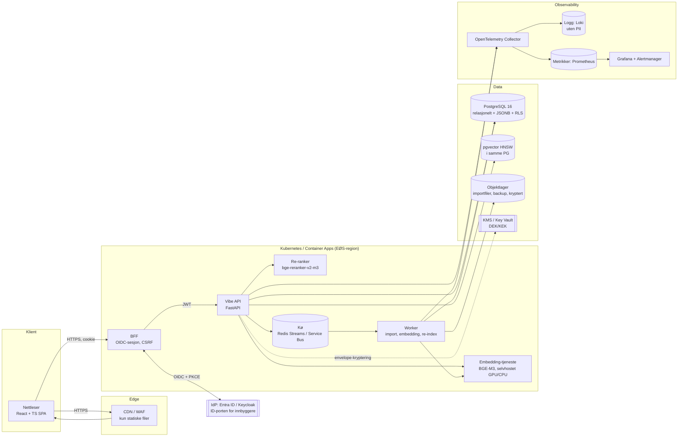
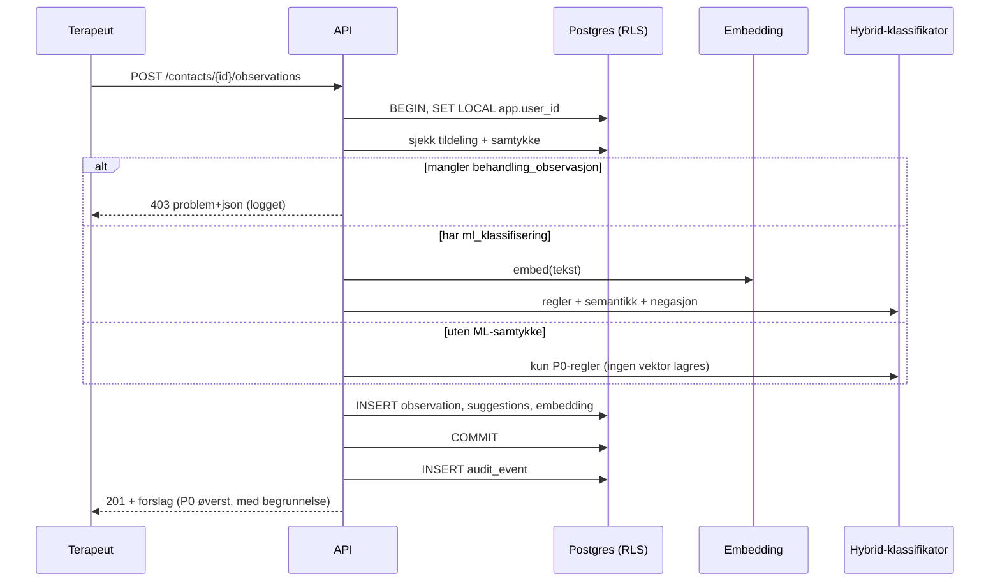

# 2. Arkitektur og teknologistack

## Høynivådiagram

### Dataflyt for en observasjon

## Anbefalt stack

| Lag | Valg | Hvorfor | Alternativ |
|---|---|---|---|
| Frontend | React 18 + TypeScript + Vite, TanStack Query, Radix UI | Tilgjengelige primitiver, typesikker | SvelteKit |
| BFF | FastAPI eller Node (Fastify) | Holder tokens unna nettleseren | API-gateway med OIDC-plugin |
| Backend | **Python 3.12 + FastAPI + Pydantic v2 + SQLAlchemy 2 / asyncpg** | Samme språk som ML-økosystemet, OpenAPI gratis | Node + NestJS |
| Relasjonell DB | **PostgreSQL 16** med RLS, JSONB, partisjonering | Én DB å sikre, revidere og ta backup av | — |
| Vektor | **pgvector (HNSW)** i samme PG | Færre databehandlere, transaksjonell sletting ved tilbaketrukket samtykke | Qdrant (selvhostet) når > 10 M vektorer; Weaviate. Pinecone frarådes (US-SaaS og helsedata) |
| Embeddings | **BGE-M3** (flerspråklig, 1024 dim, god på norsk) selvhostet | Ingen helsedata ut av eget miljø | multilingual-e5-large; NorBERT-familien for finjustering |
| Re-rank | bge-reranker-v2-m3 | Kryss-encoder for topp-20 | — |
| Tekstklassifikator | Finjustert XLM-R / NB-BERT (multi-label) når ≥ 300 eksempler per kode | Bedre presisjon enn ren likhet | Logistisk regresjon på embeddings (baseline) |
| Kø / jobber | Redis Streams eller Azure Service Bus + arq/Celery | Import, re-embedding | — |
| Auth | OIDC (Entra ID / Keycloak), ID-porten for innbyggere | SSO, MFA, roller i claims | — |
| Hemmeligheter / nøkler | Azure Key Vault / HashiCorp Vault | Envelope-kryptering, rotasjon | — |
| Container / orkestrering | Docker, Kubernetes (AKS) eller Azure Container Apps | Samme image fra dev til prod | On-prem: k3s / OpenShift |
| IaC | Terraform + Helm | Reproduserbart | Bicep |
| CI/CD | GitHub Actions (mal i `ci/github-actions.yml`) | Miljøgodkjenning, OIDC til sky | GitLab CI |
| Observability | OpenTelemetry → Prometheus, Loki, Tempo, Grafana | Åpen standard | Azure Monitor |
| CDN / WAF | Azure Front Door / Cloudflare (kun statiske filer, ingen API-caching) | — | — |

## Arkitekturprinsipper

1. **Én kilde til sannhet**: relasjonsdata og vektorer i samme Postgres til volumet krever noe annet.
2. **Helsedata forlater ikke miljøet**: modellene er selvhostet. Eventuell ekstern LLM (til oppsummering) kun etter DPIA, med databehandleravtale og EØS-prosessering, og alltid på pseudonymisert tekst.
3. **Sikkerhet i databasen, ikke bare i appen**: RLS, append-only audit, uforanderlige kodeversjoner (testet i `db/schema.sql`).
4. **Forklarbarhet**: hvert forslag har `matched_signals`, `rule_score` og `semantic_score`.
5. **Utbyttbart ML-lag**: `Embedder`-protokollen (`backend/app/embeddings.py`) gjør modellbytte til en konfigurasjonsendring pluss en re-embedding-jobb.

## To-do

- [ ] Velg sky og region, eller on-prem (kap. 14)
- [ ] Bestem IdP og rollekilde (AD-grupper eller egen tabell)
- [ ] Ytelsestest BGE-M3 på CPU kontra GPU med forventet volum

## Prioritert backlog

| # | Punkt | Prioritet |
|---|---|---|
| 1 | BFF med OIDC + PKCE | Må |
| 2 | Embedding-tjeneste bak intern HTTP med batch | Må |
| 3 | Re-ranker | Bør (MLP) |
| 4 | Qdrant-migreringssti | Kan |
