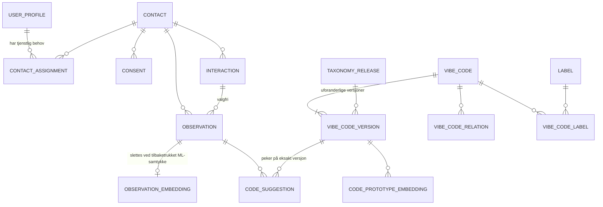

# 3. Datamodell og kunnskapsbase

Fullt, kjørbart skjema: [`db/schema.sql`](../db/schema.sql). Det er verifisert mot PostgreSQL 16 + pgvector 0.6. Disse fem tingene er testet: aktivering uten godkjenning avvises, selvgodkjenning avvises, `UPDATE` på kodeversjon avvises, RLS skjuler en annen terapeuts kontakter, og `DELETE` på audit nektes for app-rollen.

## ER-diagram

## Entiteter

### VibeCode (`vibe_code` + `vibe_code_version`)

| Felt | Type | Beskrivelse | Indeks |
|---|---|---|---|
| `code_id` | text `^VC-\d{3}$` | Stabil identitet | PK |
| `version` | int | Øker ved hver endring | PK |
| `taxonomy_version` | text (CalVer) | Utgivelsen versjonen tilhører | FK |
| `name`, `definition`, `category` | text | Faglig innhold | — |
| `priority` | enum P0–P3 | P0 = sikkerhet | — |
| `status` | enum draft/active/deprecated | Aktiv krever `approved_by ≠ created_by` | delvis indeks `WHERE status='active'` |
| `trigger_signals` | jsonb | `{patterns[], semantic_examples[]}` | GIN `jsonb_path_ops` |
| `counter_examples`, `recommended_actions`, `composition`, `safeguards` | jsonb | Se mal i kap. 4 | — |
| `change_note`, `created_by`, `approved_by`, `created_at` | — | Sporbarhet | — |

### Kontakt (`contact`)

| Felt | Type | Merknad |
|---|---|---|
| `id` | uuid | Intern nøkkel overalt |
| `pseudonym` | text unik | Vises i UI og logger (`K-7F3A21`) |
| `name_enc` | bytea | Envelope-kryptert med KMS-nøkkel |
| `birth_year` | smallint | Dataminimering: år, ikke dato |
| `external_ref_hash` | bytea unik | HMAC-SHA256 av EPJ- eller CRM-id: idempotent import uten å lagre id-en i klartekst |
| `attributes` | jsonb | Ikke-sensitive, fleksible felt |
| `deleted_at` | timestamptz | Myk sletting, så hard sletting etter frist |

### Interaksjon (`interaction`)

| Felt | Type | Indeks |
|---|---|---|
| `id` | uuid | PK |
| `contact_id` | uuid FK | `(contact_id, started_at DESC)` |
| `user_id` | uuid FK | — |
| `kind` | time/telefon/chat/innsjekk/gruppe | — |
| `started_at`, `ended_at` | timestamptz | — |
| `attributes` | jsonb | — |

### Observasjon (`observation`)

| Felt | Type | Merknad | Indeks |
|---|---|---|---|
| `id` | uuid | PK | — |
| `contact_id` | uuid FK | RLS-nøkkel | `(contact_id, observed_at DESC)` |
| `interaction_id` | uuid FK null | — | — |
| `source` | enum | samtale/innsjekk/notat/import | — |
| `text_enc` | bytea | Feltkryptert fritekst | — |
| `attributes` | jsonb | **Heterogene data**: skalaer, skjema-svar | GIN |
| `schema_ref` | text | Versjonert JSON Schema for `attributes`, for eksempel `innsjekk.v2` | — |
| `classified` | bool | Om ML ble kjørt (samtykke) | — |

`observation_embedding` (vektor, HNSW-indeks) og `code_suggestion` (forslag med `status`, `classifier_version`, `reviewed_by`) ligger i egne tabeller. Da kan vektorer slettes uten å røre journalen, og hvert forslag kan spores til eksakt kode- og modellversjon.

### Brukerprofil (`user_profile`)

| Felt | Type |
|---|---|
| `id` | uuid |
| `oidc_subject` | text unik |
| `display_name`, `role`, `org_unit`, `locale` | — |
| `preferences` | jsonb |
| `deactivated_at` | timestamptz |

### Samtykke (`consent`)

| Felt | Type | Merknad |
|---|---|---|
| `purpose` | enum | `behandling_observasjon`, `ml_klassifisering`, `forskning_anonymisert`, hver for seg |
| `text_version` | text | Hvilken tekst personen faktisk så |
| `granted_at`, `withdrawn_at` | timestamptz | Unik delvis indeks: maks ett aktivt per formål |
| `channel`, `recorded_by` | — | Dokumentasjon |

### Etiketter og taksonomi (`label`, `vibe_code_label`, `vibe_code_relation`, `taxonomy_release`)

Hierarkiske etiketter (`parent_id`) av typene kategori, tema, målgruppe og intervensjonstype. Relasjoner mellom koder er typet: `relatert`, `forsterkes_av` (komposisjon) og `erstatter` (ved utfasing).

## Fleksible felter: JSONB-regler

1. **Alt som filtreres eller joines på, blir egne kolonner.** JSONB er for data med varierende form.
2. Hver JSONB-struktur har `schema_ref` og et JSON Schema i repoet (`schemas/observation/innsjekk.v2.json`). Det valideres i API-et før skriving.
3. GIN-indeks med `jsonb_path_ops` for `@>`-spørringer. Felt som brukes mye, løftes til genererte kolonner: `ALTER TABLE observation ADD COLUMN mood smallint GENERATED ALWAYS AS ((attributes->>'humør_1_5')::smallint) STORED;`
4. Ingen direkte identifikatorer i JSONB. Det sjekkes av en lint i CI som ser etter fødselsnummermønster.

## Versjonering og migrasjoner

| Hva | Strategi |
|---|---|
| Vibe Codes | Uforanderlige rader `(code_id, version)`. Forslag peker på eksakt versjon. Utfasing via `status=deprecated` + relasjon `erstatter` |
| Taksonomi | CalVer-utgivelser (`2026.10.0`). En utgivelse fryser et sett versjoner. Endringslogg genereres fra `change_note` |
| Embeddings | `model_id` er en del av nøkkelen. Ny modell skrives side om side og byttes atomisk (blå/grønn), gammel slettes etter 30 dager |
| Skjema | Alembic/Flyway, `V###__beskrivelse.sql`, kun fremover. **Expand → migrate → contract**: legg til kolonne, dobbeltskriv, backfill, bytt lesing, fjern gammel i en senere utgivelse |
| Destruktive endringer | Krever egen PR med backup-verifisering og plan for tilbakerulling |
| JSON Schema | Semver per `schema_ref`. Gamle versjoner leses alltid, nye skrives |

## To-do

- [ ] Velg Alembic (Python) og skriv `V001` fra `db/schema.sql`
- [ ] JSON Schema for `innsjekk.v1` (humør 1–5, søvn, energi)
- [ ] Bytt in-memory-store mot `PostgresStore` med `SET LOCAL app.user_id`

## Prioritert backlog

| # | Punkt | Prioritet |
|---|---|---|
| 1 | `PostgresStore` + RLS-integrasjonstest | Må |
| 2 | Feltkryptering (envelope) for `text_enc` og `name_enc` | Må |
| 3 | Hash-kjede i `audit_event.prev_hash` | Bør |
| 4 | Månedlig partisjonsjobb for audit | Bør |
| 5 | Genererte kolonner for mye brukte JSONB-felt | Kan |
