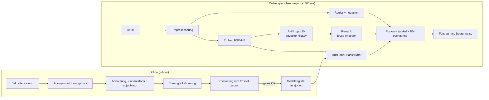

# 6. Embeddings og ML-pipeline

## Pipeline



### 1. Preprosessering
- Unicode NFC, små bokstaver for regex (modellen får original tekst).
- **Pseudonymisering før embedding**: navn, telefon, e-post, fødselsnummer og adresser erstattes med `[NAVN]`, `[TLF]` osv. (Presidio med norske gjenkjennere + regex for fødselsnummer med kontrollsifferet validert). Da inneholder vektorene ikke direkte identifikatorer.
- Setningssplitt for lange notater. Lagre embedding per notat (gjennomsnitt) og per setning (for treffmarkering) når tekst > 512 tokens.
- Språkdeteksjon (nb/nn/en). nn får egne mønstervarianter.

### 2. Embedding
| Valg | Dim | Merknad |
|---|---|---|
| **BGE-M3** (anbefalt) | 1024 | Flerspråklig, sterk på norsk, 8k kontekst, MIT-lisens |
| multilingual-e5-large | 1024 | Krever prefiks `query:` / `passage:` |
| HashingEmbedder (dev) | 512 | Deterministisk, null avhengigheter, brukes i test og CI |

Modellen kjøres selvhostet (Text Embeddings Inference-container). Batch på 32, normaliserte vektorer.

### 3. Vektorlagring
- **pgvector HNSW** (`m=16, ef_construction=64`, `ef_search=40`), cosinus.
- To tabeller: `code_prototype_embedding` (liten, ~12 × 20 vektorer) og `observation_embedding` (vokser).
- Byttepunkt: Qdrant (selvhostet) når > 10 M vektorer eller p95 for ANN > 50 ms. Weaviate ved behov for innebygd hybrid-BM25. Pinecone frarådes for helsedata.

### 4. Semantisk søk og retrieval + re-rank
1. ANN topp-20 mot prototyper (og eventuelt kontaktens egne tidligere observasjoner, filtrert på RLS).
2. Re-rank med `bge-reranker-v2-m3` (spørring, kodedefinisjon + eksempel).
3. Fusjon: `score = 0,3·regel + 0,7·re-rank` for søk; for klassifisering, se kap. 4.

## Treningsdata

### Annotasjonsformat (JSONL)

```json
{"sample_id": "6b1e…", "text": "Våknet med pakker på døra, husker ikke at jeg bestilte",
 "lang": "nb", "source": "innsjekk",
 "labels": ["VC-009", "VC-008"],
 "spans": [{"start": 23, "end": 35, "code": "VC-009", "text": "husker ikke"}],
 "annotator": "ann-04", "confidence": 4, "guideline_version": "1.2",
 "negated": [], "notes": ""}
```

### Krav

| Krav | MVP | Produksjon |
|---|---|---|
| Eksempler per kode | 30 (syntetiske + fagskrevne) | ≥ 300 ekte, anonymiserte |
| Negative eksempler (ingen kode) | 20 % av settet | 30 % |
| Moteksempler per kode | 10 | 50 |
| P0-eksempler | 50 fagskrevne varianter | ≥ 500, inkludert indirekte formuleringer |
| Annotatorer per eksempel | 1 + fagkontroll | 2 uavhengige + adjudikator |
| Splitt | — | 70/15/15, stratifisert, **gruppert per kontakt** (ingen lekkasje) |
| Testsett | Gullsett i repo | Frosset, versjonert, aldri brukt i trening |

### Kvalitetssikring
- **Inter-annotator-enighet**: Krippendorffs α (multi-label) eller Cohens κ per kode. Krav: κ ≥ 0,70 per kode, ≥ 0,85 for VC-012. Koder under kravet går tilbake til definisjonen. Uenighet er nesten alltid et definisjonsproblem, ikke et annotatorproblem.
- Kalibreringsrunde: 50 felles eksempler før hver ny retningslinjeversjon.
- Automatiske sjekker: duplikater, lekkasje mellom splitt, PII-skann, label-distribusjon.
- Etikettstøy: Cleanlab på treningssettet, med manuell gjennomgang av flaggede eksempler.

## Evaluering

| Metrikk | Hvor | Krav |
|---|---|---|
| Precision, recall, F1 per kode | Klassifisering | F1 ≥ 0,75 (MVP), ≥ 0,85 (prod) |
| **Recall VC-012** | Klassifisering | **1,00 på testsett**, blokkerer utrulling |
| Falsk positiv-rate VC-012 | Klassifisering | Overvåkes. Høy FPR er akseptabelt, men gir alarmtretthet |
| Mikro / makro-F1 | Samlet | Makro avslører svake koder |
| precision@k, recall@k, nDCG@10, MRR | Semantisk søk | P@3 ≥ 0,7 |
| Kalibrering (ECE) | Score-tolkning | ECE < 0,05 |
| Rettferdighet: F1 per kjønn, alder, dialekt og språk (nb/nn) | Bias | Avvik < 5 pp |
| Menneskelig evaluering | Ukentlig | 50 tilfeldige forslag vurdert av fagperson: korrekt, nyttig, skadelig? |
| Bekreftelsesrate i drift | Online | Fall > 10 pp på en uke = alarm |

Gjeldende gullsett ([`data/golden_set.jsonl`](../data/golden_set.jsonl), 25 rader) gir precision 1,00, recall 0,96 og F1 0,98, med krise-recall 1,00. **Det er en røyktest, ikke en validering.** Eksemplene er skrevet av samme hånd som mønstrene, så tallene er optimistiske. Ekte tall krever klinisk annotert data fra kap. 6-kravene over.

## To-do

- [ ] Sett opp TEI-container med BGE-M3, mål latens på mål-hardware
- [ ] Skriv annoteringsretningslinje v1.0 (kap. 12)
- [ ] Bygg PII-maskering med norske gjenkjennere
- [ ] Utvid gullsettet til 200 rader med fagskrevne moteksempler

## Prioritert backlog

| # | Punkt | Prioritet |
|---|---|---|
| 1 | PII-maskering før embedding | Må |
| 2 | BGE-M3 bak `Embedder`-protokollen | Må |
| 3 | Frosset testsett + CI-gate | Må |
| 4 | Re-ranker | Bør |
| 5 | Finjustert multi-label-klassifikator | Bør (MLP) |
| 6 | Aktiv læring fra bekreftet/avvist | Kan |
